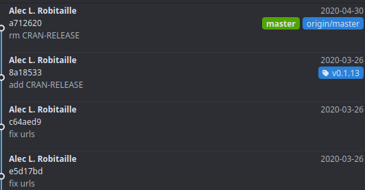
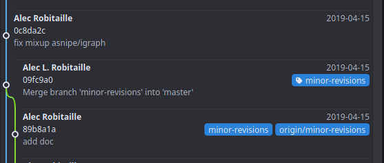
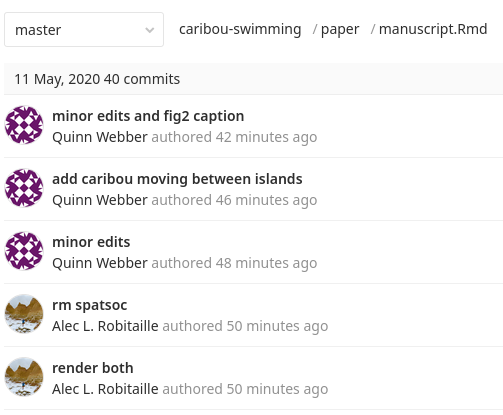
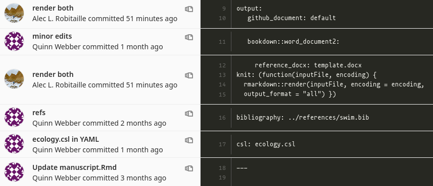

# (PART) Open research {-} 
# Git

**TODO: ALR**

* how to avoid conflicts
* why use branches
* what is a pull/merge request
* commit before push/pull
* commit messages
* .gitignore
* why use git
* what can you do with git (projects, packages, websites, books, etc)\
* oops big files - use the BFG

## `.gitignore`

### Include one file in an ignored folder

Use a wildcard `*` to exclude everything in a folder and include the file with `!`. The wildcard should be specified exactly on the folder, not the larger directory. In the example below, we ignore everything in the `data/derived-data` folder, not just the `data/` folder. 

Eg. in file `.gitignore`:

```
.Rproj.user
.Rhistory
.RData
.Ruserdata

data/raw-data/
data/derived-data/*
!/data/derived-data/output.Rds
```


## Tags
We can add git tags to our commits, to keep track of specific versions or steps of a repository. 

For example, spatsoc and other packages use git tags to mark specific versions of the package. These versions link to GitHub/GitLab [releases](https://github.com/ropensci/spatsoc/releases), making it easy to install specific versions. 



For papers, you can track different stages of revisions:



To add a tag in GitAhead, just right click on the commit, add tag, then fill in the name (no spaces) and check "push to origin". Then you will be able to find the tags on gitlab
for example: [`wildcam` tags](https://gitlab.com/robit.a/wildcam/-/tags). 

## Blame and history

[Git Blame](https://docs.gitlab.com/ee/user/project/repository/git_blame.html) and [Git History](https://docs.gitlab.com/ee/user/project/repository/git_history.html) can be used to get information about when files were changed and by who. 

For example: head over to GitLab.com and browse to one of your files. Open it up and select "history". You will all the times the file was changed, and selecting any of the commits will show you what it looked like at that point. 



Alternatively, you can use select "blame" to show who changed each line in a file and at which commit. 



## Issues

Issues are a tool available on GitLab and GitHub for collaborating on projects, getting help and tracking decisions. They are used extensively in the FOSS world and are often the way `R` package developers opt to receive bug reports and feature requests from their users.

Issues can be used for both **personal** and **group** projects. Some uses include:

* collaborating
* developing methods
* troubleshooting code
* tracking decisions or assumptions
* defining thresholds, variables
* reporting bugs
* requesting new features

Issues have a number of advantages over private email, in-person conversations or `TODO`, `NOTE` and other comments embedded in code because they:

* are easily searched
* can be grouped or categorized using labels
* can be assigned to individuals, groups or teams
* keep everyone in the loop
* are a resource for future users (including yourself!)
* allow for asynchronous communication
* keep track of the history of decisions, progress, etc.

### Example issues
#### Bug or troubleshooting
> I'm trying to do this and it isn't working

```{r, eval = FALSE}
# Some concise title
(One/two sentence description summarizing issue. )

## Steps to reproduce
(How one can reproduce the issue)
1.
2.
3.

## Observed behaviour

## Expected behaviour

## Sample of output tables, screenshots

## Possible fixes

## Session info
(if R related, paste the results of sessionInfo())
```

#### Method development
> I'd like to try and do this

```{r, eval = FALSE}
# Some concise title
(One/two sentence description summarizing the objective. )

## Description
(Include goals, use cases, benefits)

## Progress
(Where did you get?)

## Next steps
(How do you think we could solve it? Who can you assign
  this issue to? Who can you mention to get their input?)

```

**And once solved, post the code that actually solved it**. This is one of the main ways that Issues can be useful to future users.


## Tracking different file types
Git won't be able to track changes in all data (eg. `.Rds` and other binary file types) and output R Markdown file types. 

For R Markdown, use simply:

```yaml
output:github_document
```

or keep the `.md` file along with your main output type. Either by [rendering multiple output formats](#rmd-multiple-output) or using:

```yaml
output:
  pdf_document:
    keep_md:true
```

```yaml
output:
  html_document:
    keep_md:true
```

Generate figures as seperate PNGs and include them in the document using `knitr::include_graphics()`. This way, the PNGs can be diffed by Git and easily viewed separate from the R Markdown output.


## GitLab CI/DI

**TODO: add examples / links to ci for package checks, website builds, host static public sites**

### Testing data

**TODO: expand to example of using ci to run tests script on output data**
Using tests is a great way to clarify your expectations about data outputs, that be checked whenever code is updated. Check out the [`testthat`](https://github.com/r-lib/testthat/) package and [`checkr`](https://poissonconsulting.github.io/checkr/) package.


## Slides {#git-slides}
Workshop: Git and Projects

Date: February 6 2020

[Slides](https://slides.robitalec.ca/git-and-projects.html) and  [Resources](https://gitlab.com/robit.a/workshops/-/archive/master/workshops-master.zip?path=git-and-projects)


```{r, echo = FALSE}
knitr::include_url('https://slides.robitalec.ca/git-and-projects.html')
```


## Resources {#git-resources}
[GitLab: Issues](https://docs.gitlab.com/ee/user/project/issues/)

[Happy Git With R](https://happygitwithr.com/)

