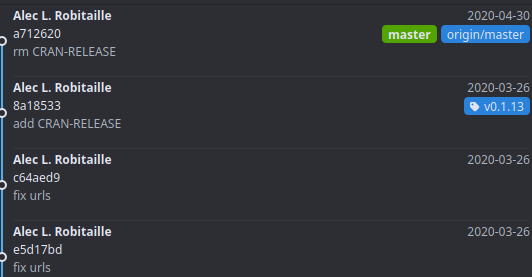
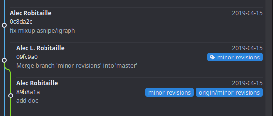
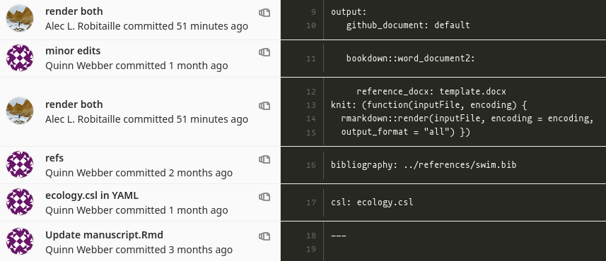

# (PART) Open research {-} 

# Git


<!-- **TODO: ALR** -->

<!-- * how to avoid conflicts -->
<!-- * why use branches -->
<!-- * what is a pull/merge request -->
<!-- * commit before push/pull -->
<!-- * commit messages -->
<!-- * .gitignore -->
<!-- * why use git -->
<!-- * what can you do with git (projects, packages, websites, books, etc)\ -->
<!-- * oops big files - use the BFG -->

## Slides {#git-slides}
Workshop: Git and Projects

Date: February 6 2020

[Slides](https://slides.robitalec.ca/git-and-projects.html) and  [Resources](https://gitlab.com/robitalec/workshops/-/archive/master/workshops-master.zip?path=git-and-projects)


```{r, echo = FALSE}
knitr::include_url('https://slides.robitalec.ca/git-and-projects.html')
```


## Resources {#git-resources}
* [Version Control - missing semester](https://missing.csail.mit.edu/2020/version-control/)
* [GitLab: Issues](https://docs.gitlab.com/ee/user/project/issues/)
* [Happy Git With R](https://happygitwithr.com/)


## Use SSH

Recently, GitHub deprecated basic passwords for authentication so my
recommendation is to use SSH throughout. See 
[Happy Git With R's SSH keys](https://happygitwithr.com/ssh-keys.html#ssh-keys) 
introduction. Then when
you grab links to clone, eg. the WEEL's ewc project, use the format
`git@gitlab.com:WEEL_grp/ewc.git` and not `https://gitlab.com/WEEL_grp/ewc.git`


## `.gitignore`

### Include one file in an ignored folder

Use a wildcard `*` to exclude everything in a folder and include the file with `!`. The wildcard should be specified exactly on the folder, not the larger directory. In the example below, we ignore everything in the `data/derived-data` folder, not just the `data/` folder. 

Eg. in file `.gitignore`:

```
.Rproj.user
.Rhistory
.RData
.Ruserdata

data/raw-data/
data/derived-data/*
!/data/derived-data/output.Rds
```


## Tags
We can add git tags to our commits, to keep track of specific versions or steps of a repository. 

For example, spatsoc and other packages use git tags to mark specific versions of the package. These versions link to GitHub/GitLab [releases](https://github.com/ropensci/spatsoc/releases), making it easy to install specific versions. 



For papers, you can track different stages of revisions:



To add a tag in GitAhead, just right click on the commit, add tag, then fill in the name (no spaces) and check "push to origin". Then you will be able to find the tags on gitlab
for example: [`wildcam` tags](https://gitlab.com/robitalec/wildcam/-/tags). 

## Blame and history

[Git Blame](https://docs.gitlab.com/ee/user/project/repository/git_blame.html) and [Git History](https://docs.gitlab.com/ee/user/project/repository/git_history.html) can be used to get information about when files were changed and by who. 

For example: head over to GitLab.com and browse to one of your files. Open it up and select "history". You will all the times the file was changed, and selecting any of the commits will show you what it looked like at that point. 


Alternatively, you can use select "blame" to show who changed each line in a file and at which commit. 



## Issues

Issues are a tool available on GitLab and GitHub for collaborating on projects, getting help and tracking decisions. They are used extensively in the FOSS world and are often the way `R` package developers opt to receive bug reports and feature requests from their users.

Issues can be used for both **personal** and **group** projects. Some uses include:

* collaborating
* developing methods
* troubleshooting code
* tracking decisions or assumptions
* defining thresholds, variables
* reporting bugs
* requesting new features

Issues have a number of advantages over private email, in-person conversations or `TODO`, `NOTE` and other comments embedded in code because they:

* are easily searched
* can be grouped or categorized using labels
* can be assigned to individuals, groups or teams
* keep everyone in the loop
* are a resource for future users (including yourself!)
* allow for asynchronous communication
* keep track of the history of decisions, progress, etc.

### Example issues
#### Bug or troubleshooting
> I'm trying to do this and it isn't working

```{r, eval = FALSE}
# Some concise title
(One/two sentence description summarizing issue. )

## Steps to reproduce
(How one can reproduce the issue)
1.
2.
3.

## Observed behaviour

## Expected behaviour

## Sample of output tables, screenshots

## Possible fixes

## Session info
(if R related, paste the results of sessionInfo())
```

#### Method development
> I'd like to try and do this

```{r, eval = FALSE}
# Some concise title
(One/two sentence description summarizing the objective. )

## Description
(Include goals, use cases, benefits)

## Progress
(Where did you get?)

## Next steps
(How do you think we could solve it? Who can you assign
  this issue to? Who can you mention to get their input?)

```

**And once solved, post the code that actually solved it**. This is one of the main ways that Issues can be useful to future users.


## Tracking different file types
Git won't be able to track changes in all data (eg. `.Rds` and other binary file types) and output R Markdown file types. 

For R Markdown, use simply:

```yaml
output:github_document
```

or keep the `.md` file along with your main output type. Either by [rendering multiple output formats](#rmd-multiple-output) or using:

```yaml
output:
  pdf_document:
    keep_md:true
```

```yaml
output:
  html_document:
    keep_md:true
```

Generate figures as seperate PNGs and include them in the document using `knitr::include_graphics()`. This way, the PNGs can be diffed by Git and easily viewed separate from the R Markdown output.


## GitLab CI/DI and GitHub Pages


<!-- **TODO: add examples / links to ci for package checks, website builds, host static public sites** -->

### Testing data


<!-- **TODO: expand to example of using ci to run tests script on output data** -->
Using tests is a great way to clarify your expectations about data outputs, that be checked whenever code is updated. Check out the [`testthat`](https://github.com/r-lib/testthat/) package and [`checkr`](https://poissonconsulting.github.io/checkr/) package.


## Moving from GitLab to GitHub {#lab-to-hub}

Four options and it depends on if you'd like your repository to be mirrored over
(dynamic, with updates) or imported (static, one time snapshot). Using the 
GitHub Importer (option 4) is easy but will only take a static snapshot. Otherwise,
adding multiple remotes (option 1), changing your remote (option 2), or using an access token (option 3) 
will all copy over future changes. 

### Option 1: Adding multiple remotes (dynamic)

If we want multiple Git repositories to be updated whenever we push, we can
set multiple remote repositories. 

```
git remote set-url origin --push --add <a remote>
git remote set-url origin --push --add <another remote>
```

Like the option below, this needs to be set for all users that want to 
push to both remote repositories. 

### Option 2: Changing your remote (dynamic)

Note: This approach locally changes your remote path to the Git repository. 
If there are multiple users of the repository, they **must** either 1) also 
change their remote path or 2) clone the new repository at the updated path (
and ideally delete the old local repository).

On GitHub.com:

1.  Make an empty repo (<https://github.com/new>). Don't select "initialize with a README" - you want an empty repository.

In GitAhead, or other Git tool on your computer:

1. Open the repository you want to move to GitHub.

2. Edit the URL of the remote. In GitAhead: Select the "Remote" menu/Select "Configure remotes"/Double click on the URL and change the value to your GitHub clone URL eg. https://github.com/wildlifeevoeco/MovingAcrossGradients.git or git@github.com:wildlifeevoeco/MovingAcrossGradients.git

3. Push. It may take longer than usual, it is going to push the entire Git history to the empty GitHub repository. 

4. Check your new GitHub repository. You should see all the commits and files there. 

If you want your GitLab version to stay up to date, use a Pull remote mirroring. 
More information here: https://docs.gitlab.com/ee/user/project/repository/mirror/pull.html


### Option 3: Using an access token (dynamic)

On GitHub.com:

1.  Make an empty repo to receive commits from GitLab (<https://github.com/new>). Don't select "initialize with a README" - you want an empty repository.

2.  Generate a new personal access token at <https://github.com/settings/tokens>

    -   Select `public_repo`

3.  Copy it, to use as password on Gitlab.com below

On GitLab.com:

1.  Navigate to "Settings/Repository" (<https://gitlab.com/user/repository/-/settings/repository>)
2.  Select "Mirror a repository"
3.  Mirror direction: Push
4.  Repository URL: `https://<your_github_username>@github.com/<your_github_group>/<your_github_project>.git`
5.  Password: paste the personal access token generated on Github here

Check results:

1.  Wait for the spinning circle to finish, make sure no errors come up.
2.  Navigate to your new GitHub repository. It may take a few minutes to update.


### Option 4: Using GitHub Importer (static)

1.  Open <https://github.com/new/import>.
2.  Select the "Owner". Note: you can select the [`wildlifeevoeco`](https://github.com/wildlifeevoeco/) as "Owner" if this is a lab paper/project. If you don't see that as an option, ask Alec to add you as a member of that group.
3.  Provide a repository name.
4.  Select "Public".
5.  Select "Begin import"
6.  If prompted for credentials, provide them for the repository that is being imported, not GitHub.
7.  Check your email for confirmation.

The GitHub Importer is described [here](https://docs.github.com/en/free-pro-team@latest/github/importing-your-projects-to-github/importing-a-repository-with-github-importer).


# Reproducibility


See the [`renv`](https://github.com/rstudio/renv/) package for reproducible package versions and 
[`targets`](https://github.com/ropensci/targets/) package for workflows. 


## Slides

Some Reproducibility 

Date: August 4 2020

Alec L. Robitaille

[Resources](https://github.com/robitalec/workshops/tree/master/some-reproducibility), [Binder](https://mybinder.org/v2/gl/robit.a%2Fsome-reproducibility-example/master?urlpath=rstudio)

Note: the workflow used `drake` which has been superseeded by `targets`. Use it
instead!


# Sharing code and data alongside manuscripts

This is a small portion of the larger discussion surrounding reproducible research: sharing manuscripts and code. Here, I'll outline some steps for turning a repository into a clean, public facing resource accompanying a paper or project.

## Examples

In our lab:

-   the [`SocCaribou`](https://github.com/wildlifeevoeco/SocCaribou) repository is a fully functioning R package with functions used for the paper, and a series of ordered scripts for running the analysis. The paper included is simply the journal's typeset version.

-   the [`spatsoc-application-paper`](https://github.com/robitalec/spatsoc-application-paper). This is a paper outlining the R package `spatsoc` developed by Alec, Quinn and Eric. Included are the scripts to generate each of the figures, the data used for the figures, and the full `.Rmd` manuscript, along with a typeset vesion.

-   the [`MovingAcrossGradients`](https://github.com/wildlifeevoeco/MovingAcrossGradients) lab paper from 2018.

Each of these repositories are also linked to [Zenodo](https://zenodo.org), with "GitHub releases" triggering an updated DOI, etc.

A couple examples from outside our group include Carl Boettiger's [nonparametric bayes](https://github.com/cboettig/nonparametric-bayes) and [noise phenomena](https://github.com/cboettig/noise-phenomena) papers.

## Linking Projects to Zenodo

(Note: right now, GitLab projects cannot be linked to Zenodo like GitHub projects can be. See [this issue](https://github.com/zenodo/zenodo-rdm/issues/1203)). 

1.  Set up your repository in the standard way with folders for data, scripts, manuscript, etc. See [here](Projects) for details.

2.  Host your repository on GitHub. Note: you can select the [`wildlifeevoeco`](https://github.com/wildlifeevoeco/) as "Owner" if this is a lab paper/project. If you don't see that as an option, ask Alec to add you as a member of that group.

    -   making [a new repository](https://github.com/new) on GitHub and pushing there. or by
    -   mirroring your existing repository from GitLab there. See [below](#lab-to-hub) or [here](https://docs.gitlab.com/ee/user/project/repository/repository_mirroring.html#setting-up-a-push-mirror-from-gitlab-to-github-core) for extended details.

3.  Create a Zenodo account, log in, link to GitHub, and turn on the repository of interest\*. [Here are all the details](https://guides.github.com/activities/citable-code/).

4.  Create your release (see [here](https://r-pkgs.org/release.html#release-version) for picking a version number), get a DOI, add it to your README with the badge shown in [here](https://zenodo.org/account/settings/github).

5.  Edit the page on Zenodo, setting up manuscript/project authors, title etc.

\* **Note:** make sure to turn on the repository of interest, *before* making the release on GitHub. At the moment, Zenodo only tracks future releases - though in progress [here](https://github.com/zenodo/zenodo/issues/1463).

\* **Note:** if you need to make changes after publishing, make those changes in the repository and add a new Git tag + release on GitHub (<https://github.com/namespace/repo-name/releases>).


## Preserving Zenodo edits across releases

If you re-release your Github repository, the new Zenodo record will lose all the
details, like authors, ORCIDs, descriptions, etc. 

A solution is to use a special file (`.zenodo.json`), and save it in your 
repository. 

Two options for making this file:

a) Manually write it (careful for syntax errors), for example:

```json
{
  "description": "<p>This repository contains the code accompanying the paper &ldquo;At a snail&rsquo;s pace: the influence of habitat disturbance on terrestrial snail movement using experimentally manipulated mesocosms&rdquo;.</p>\n\n<p>This project depends on some incredible R packages. We use <a href=\"https://github.com/ropensci/targets\"><code>targets</code></a> for declaring the workflow and <a href=\"https://github.com/rstudio/renv\"><code>renv</code></a> for a reproducible environment. General processing uses <a href=\"https://github.com/Rdatatable/data.table\"><code>data.table</code></a> and plotting with <a href=\"https://github.com/tidyverse/ggplot2\"><code>ggplot2</code></a> and <a href=\"https://github.com/thomasp85/patchwork\"><code>patchwork</code></a>. iSSA methods with <a href=\"https://github.com/jmsigner/amt\"><code>amt</code></a>, <code>raster</code> and <code>sf</code>, modeling with <a href=\"https://github.com/glmmTMB/glmmTMB/\"><code>glmmTMB</code></a> and <code>lme4</code>.</p>", 
  "title": "Code accompanying - At a snail's pace: the influence of habitat disturbance on terrestrial snail movement using experimentally manipulated mesocosms", 
  "creators": [
    {
      "affiliation": "Memorial University", 
      "name": "Emily Denief"
    }, 
    {
      "orcid": "0000-0001-5449-5449", 
      "affiliation": "Memorial University", 
      "name": "Julie W. Turner"
    }, 
    {
      "orcid": "0000-0002-5622-4973", 
      "affiliation": "Memorial University", 
      "name": "Christina M. Prokopenko"
    }, 
    {
      "orcid": "0000-0002-4706-1762", 
      "affiliation": "Memorial University", 
      "name": "Alec L. Robitaille"
    }, 
    {
      "orcid": "0000-0002-8534-4317", 
      "affiliation": "Memorial University", 
      "name": "Eric Vander Wal"
    }
  ]
}
```

b) Generate one on Zenodo after you edit the record, then save it in the repository
	1. Open your Zenodo record (eg. following the link in the badge)
	1. Edit the record (top left, orange button)
	1. Save the record
	1. Export the record as a JSON (bottom of the page)
	1. Grab the metadata chunk within this exported JSON (edit it so it looks like the above example)

## Resources

A recent community call with rOpenSci: [summary blog](https://ropensci.org/blog/2018/11/29/codereview/) and [notes](https://docs.google.com/document/d/1LfyhgsbVgLWgWPhS0nbaBIZSFjireEBBSYL4PmhUJis/edit).

A paper on [research compendium](/user_uploads/4422/JZqXfCyHQv5eePmN7vFYoIwM/Packaging-Data-Analytical-Work-Reproducibly-Using-R-and-Friends.pdf) from Lincoln Mullen and Carl Boettiger.

[Details in the GitLab docs on mirroring](https://docs.gitlab.com/ee/workflow/repository_mirroring.html#setting-up-a-push-mirror-from-gitlab-to-github-core)

