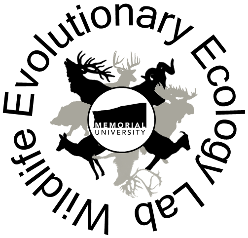

--- 
title: "WEEL Guide"
author: Alec L. Robitaille, Juliana Baluffi-Fry, Quinn M.R. Webber, Julie W. Turner, Isabella C. Richmond, Christina M. Prokopenko, Katrien A. Kingdon
date: "`r Sys.Date()`"
site: bookdown::bookdown_site
output: bookdown::bs4_book
bibliography: packages.bib
nocite: '@*'
url: https://weel.gitlab.io/guide
cover-image: "images/big-logo.png"
description: |
  This guide is for students and friends of the Wildlife Evolutionary Ecology Lab.
---

# Welcome

 

Wildlife Evolutionary Ecology Lab: Guide

Alec L. Robitaille, Juliana Baluffi-Fry, Quinn M.R. Webber, Julie W. Turner, Isabella C. Richmond, Christina M. Prokopenko, Katrien A. Kingdon

This guide is for students and friends of the Wildlife Evolutionary Ecology Lab.
At the moment, it walks through some of the steps from setting up your computer,
to analysis and visualization, to writing and sharing your outcomes with others.
Some parts of the guide present the authors' opinions - but there's always a
number of ways to do something. Use whatever works best for you. This is
a living resource, so please contribute anything you feel would be useful 
to others. 

Feedback, suggestions, comments [here](https://gitlab.com/weel/guide/-/issues). 

Source code for this book is [here](https://gitlab.com/weel/guide). 

The lab's website is at https://weel.gitlab.io/. You can find us as
[WEEL_grp on GitLab](https://gitlab.com/WEEL_grp) and [wildlifeevoeco on GitHub](https://github.com/wildlifeevoeco/), as well as [wildlifeevoeco on Twitter](https://twitter.com/wildlifeevoeco). 

